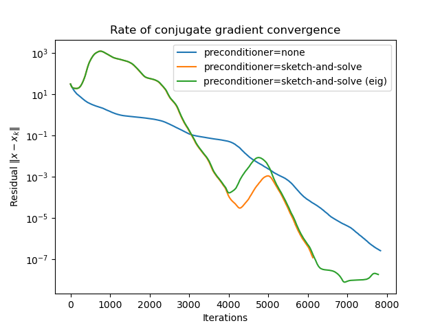

# Information-theoretic Nyström method

This repository contains source code implementing the
"Information-theoretic Nyström method", a course project of [10-716
Advanced Machine Learning](https://www.cs.cmu.edu/~pradeepr/716/).

## Requirements

See `flake.nix` for a complete list of dependencies.

- gpjax
- jax
- matplotlib
- numpy
- pandas
- scipy
- seaborn

In particular, `pip install gpjax jax seaborn` should be sufficient.

## Running

Run

```sh
python cg.py
```

to reproduce figure 1 in the report. The source code for generating Figures
2 and 3 are not included in this repository due to time constraints.

## Experimental results


